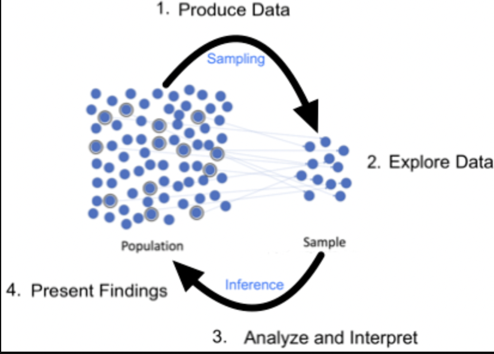

```{r, include = FALSE}
library(here)
library(tidyverse)
```


```{r xaringanExtra-clipboard, echo=FALSE}
htmltools::tagList(
  xaringanExtra::use_clipboard(
    button_text = "<i class=\"fa fa-clipboard\"></i>",
    success_text = "<i class=\"fa fa-check\" style=\"color: #90BE6D\"></i>",
  ),
  rmarkdown::html_dependency_font_awesome()
)
```

# Antes de empezar

.pull-left[
.full-width[
.content-box-grey[
**Tiempo: 8 minutos**

En grupos de 2 o 3, respondan a las siguientes preguntas: 

¿Qué son las **estadísticas inferenciales**?

¿Por qué las necesitamos? 

¿Cuál es su grado de precisión? 
]]]

---

# ¿Qué son las **estadísticas inferenciales**?

.large[
.pull-left[
Las **estadísticas inferenciales** son pruebas que utilizamos para hacer inferencias sobre una población de la que no podemos reunir todos los datos.
]]



---

# ¿Por qué las necesitamos? 

.large[
.pull-left[
Necesitamos pruebas estadísticas inferenciales para argumentar que las diferencias entre dos muestras no se deben al azar.
]]


---

# ¿Cuál es su grado de precisión? 

.large[
.pull-left[
La precisión específica depende del nivel de significación: en muchos campos, el 5% de los resultados son falsos positivos.
]]

--

.large[
.pull-right[
Podemos demostrarlo mediante una simulación en una lengua de programación como R.
]]

---

class: title-slide-section, middle

## Las estadísticas inferenciales también pueden tener resultados **falsos negativos**. 


---


# La baja poder estadístico

--

.large[
.pull-left[
El poder o la potencia estadística se refiere a la .blue[probabilidad de detectar un efecto] en un experimento dada una determinada cantidad de datos.

**La baja potencia tiene importantes consecuencias**
]]

--

.large[
.pull-left[
**Falsos negativos**: La baja potencia conlleva una gran cantidad de falsos negativos. 

**The Winner's Curse**: Los estudios de baja potencia que sí encuentran un efecto tienen (casi) la garantía de sobreestimarlo.
]]

---

class: title-slide-section, middle

## Parte 1:  Una menor potencia provoca una mayor proporción de resultados **falsos negativos**. 

---

background-image: url(./img/fp.png)
background-size: contain

---


background-image: url(./img/slide1.png)
background-size: contain

---

background-image: url(./img/slide2.png)
background-size: contain

---


background-image: url(./img/slide3.png)
background-size: contain

---

background-image: url(./img/slide4.png)
background-size: contain

---

background-image: url(./img/slide5.png)
background-size: contain

---

background-image: url(./img/slide6.png)
background-size: contain

---

background-image: url(./img/slide7.png)
background-size: contain

---

background-image: url(./img/slide8.png)
background-size: contain

---

background-image: url(./img/slide9.png)
background-size: contain

---

background-image: url(./img/slide10.png)
background-size: contain

---

class: title-slide-section, middle

### Creo que los resultados de los exámenes de Texas Tech son **10 puntos más altos** en promedio.

--

### ¿Cuántos exámenes necesitamos «obtener» de cada lugar?

---

# ¡Vamos a simular el robo!

--
.large[
**Simulamos la población entera**

Supogamos que hay **500** examenes en cada lugar.

Nota media en Texas Tech = .red[75] puntos.

Nota media en UT Austin = .orange[65] puntos.
]

--

```{r}
# Load libraries 
library(tidyverse)
# Set the seed so that we can reproduce the simulation exactly
set.seed(920)
# Set the level of variation 
sd_for_all = 20

## Simulating Texas Tech math scores
tt_math = data.frame(scores = rnorm(n = 500, mean = 75, sd = sd_for_all)) %>% 
  mutate(source = "texas_tech")

## Simulating UT Austin math scores
ut_math = data.frame(scores = rnorm(n = 500, mean = 65, sd = sd_for_all)) %>% 
  mutate(source = "ut_austin")
```

---

# ¡Vamos a simular el robo!

--
.large[
Ahora, simulamos tomar una **muestra** de esta población.

Cuando tomamos una muestra, **extraemos aleatoriamente** puntos de datos de una población.

En este ejemplo, extraemos 10 filas de cada una de las poblaciones de 500.
]
--

```{r}
# Specify here what your guess is - how many tests do we need?
guess = 10
# Set the seed so that we can reproduce the simulation exactly
set.seed(4)
# Extract a number of rows from the underlying distribution equal to `guess`
tt_sample = sample_n(tt_math, size = guess)
ut_sample = sample_n(ut_math, size = guess)
# Calculate the mean difference between the extracted samples - remember the true difference is 10
mean(tt_sample$scores)-mean(ut_sample$scores)
```

--

La diferencia, `r round(mean(tt_sample$scores)-mean(ut_sample$scores), digits = 2)`, es menor que la verdadera diferencia de 10 puntos.

---

# ¡Vamos a simular el robo!

--
.large[
Ahora cabe preguntarse: ¿es significativa esta diferencia o se debe simplemente al azar?
]

--

Para responder, utilizaremos una .blue[prueba t] para decidir. 

Esta prueba analiza si podemos concluir que existen diferencias entre dos conjuntos de datos.

--

**La regla de decisión usando el .blue[valor p]**

Si .green[p < .05], decimos que hay una .green[diferencia significativa].

Si .blue[p > .05], decimos que el resultado es .blue[no significativo].

---

# ¡Vamos a simular el robo!

.large[
Realicemos la prueba t en R.
]

--

```{r}
t.test(tt_sample$scores, ut_sample$scores)
```

--

El valor p `r round(t.test(tt_sample$scores, ut_sample$scores)[["p.value"]], digits = 2)`. **¿Qué concluimos??**

--

No encontramos **ninguna prueba** de que Texas Tech sea mejor en Matemáticas que UT Austin.

--

Pero en realidad hay una diferencia, ¡simplemente no teníamos datos suficientes para encontrarla!

--

Este resultado se llama un hallazgo **falso negativo** (o error de tipo II): no detectamos una diferencia que existe en la realidad. 

---

## ¿Y si hemos tenido mala suerte? **El error de muestreo** podría ser el culpable.

```{r, echo = FALSE}
knitr::include_app("https://kparrish92.shinyapps.io/pa_demo/", height = "600px")
```

---

class: title-slide-section, middle

### Si repetimos el muestreo aleatorio **100 veces**, obtendríamos una diferencia significativa sólo el **11%** de las veces.

--

### Por lo tanto, decimos que la **potencia** de la muestra de tamaño 10 en este contexto es de 0,11.

--

### Queremos que sea **0,80**

---

# ¿Y si aumentamos el tamaño de la muestra?

```{r, echo=FALSE}
# Create a function to run a single power analysis, given two samples, a number of desired iterations (i) and the size of group 1 (n1) and group 2 (n2)
power_analysis_single_ul = function(s1, s2, i, n1, n2)
{
  loop_df = matrix(nrow = i)
  
  for(thisRun in 1:i){
    sample_1 = s1 %>% sample_n(n1)
    sample_2 = s2 %>% sample_n(n2)
    t_test = t.test(sample_1$scores,sample_2$scores)
    loop_df[thisRun] = t_test$p.value
    
  }
  return(sum(loop_df < .05)/i)
}

# Run the function to check our power
twen = power_analysis_single_ul(tt_math, ut_math, i = 1000, n1 = 20, n2 = 20)
thirty = power_analysis_single_ul(tt_math, ut_math, i = 1000, n1 = 30, n2 = 30)
fourty = power_analysis_single_ul(tt_math, ut_math, i = 1000, n1 = 40, n2 = 40)
fifty = power_analysis_single_ul(tt_math, ut_math, i = 1000, n1 = 50, n2 = 50)
sixty = power_analysis_single_ul(tt_math, ut_math, i = 1000, n1 = 60, n2 = 60)
seven = power_analysis_single_ul(tt_math, ut_math, i = 1000, n1 = 70, n2 = 70)
eight = power_analysis_single_ul(tt_math, ut_math, i = 1000, n1 = 80, n2 = 80)
```

Podemos ver que la probabilidad de encontrar nuestro efecto aumenta en función del tamaño de la muestra.

### La potencia del tamaño de la muestra **20** es .red[`r twen`]

--

### La potencia del tamaño de la muestra **30** es .red[`r thirty`].

--

### La potencia del tamaño de la muestra **40** es .red[`r fourty`].

--

### La potencia del tamaño de la muestra **50** es .red[`r fifty`].

--

### La potencia del tamaño de la muestra **60** es .red[`r sixty`].

--

### La potencia del tamaño de la muestra **70** es .red[`r seven`].

--

### La potencia del tamaño de la muestra **80** es .red[`r eight`].

---

class: title-slide-section, middle

## La respuesta: Necesitamos **80 examenes** en total de cada escuela para demostrar que nuestro amigo no tiene razón.

---

background-image: url(./img/slide7.png)
background-size: contain

---
class: title-slide-section, middle
## ¿Y si **tenemos suerte** y encontramos un efecto en un estudio con poca potencia?

---

background-image: url(./img/golden_ticket.jpg)
background-size: contain


---

class: title-slide-section, middle

## Parte 2: The winner's curse: los estudios de baja potencia inflan los efectos reales. 

--

#### Volvamos al Shiny App

--

Por favor, escriba las diferencias de los promedios que encontramos cuando las muestras aleatorias son significativamente diferentes.

--

Vemos que estas diferencias son con mucha frecuencia mayores que la diferencia real del 10.
---

background-image: url(./img/slide7.png)
background-size: contain

---

# The Winner's Curse: un ejemplo práctico.

.large[
Mi amigo de la UT quiere mejorar los resultados de UT en matemáticas y alcanzar a Texas Tech.
]

--

.large[
La Universidad está dispuesta a invertir **10.000 $ por punto de nota** que separe a las dos escuelas - 100k sería la inversión correcta.
]

---

# The Winner's Curse: un ejemplo práctico.

Si nuestra potencia fue de **0,4** y encontramos un resultado significativo la diferencia media es de **13,5 puntos** 

--

Gastaríamos un 35% más de recursos en la intervención que realmente necesario (135.000 dólares frente a 100.000).

--

```{r}
i = 1000
loop_df = matrix(nrow = i, ncol = 2)
  for(thisRun in 1:i){
    sample_1 = tt_math %>% sample_n(30)
    sample_2 = ut_math %>% sample_n(30)
    t_test = t.test(sample_1$scores,sample_2$scores)
    loop_df[thisRun, 1] = t_test$p.value
    loop_df[thisRun, 2] = mean(sample_1$scores)-mean(sample_2$scores)
  }
results = loop_df %>% as.data.frame() %>% 
  rename("p_value" = "V1") %>%  
  rename("mean_difference" = "V2") %>% 
  filter(p_value < .05)
nrow(results)/i # power
mean(results$mean_difference) # mean effect size
```

---

class: title-slide-section, middle

# Parte 3: ¿Qué hacemos?

---

# Análisis de potencia

.large[
La potencia consiste en detectar un efecto en un cierto **grado de variación.**
]

--

.large[
En nuestro ejemplo, no he mencionado que la desviación típica fue de 20.
]

--

.large[
**En grupos**: Dentro de su interés de investigación, ¿cuál es un ejemplo de desviación estándar?

Parte 1: Busca un artículo y encuentra una desviación estándar

Parte 2: Multiplica la desviación típica por 0,4, 0,7 y 1.

¿Alguno de estos valores es demasiado pequeño para suponer una diferencia en la realidad?
]

---

# Análisis de potencia

.large[
.4, .7 y 1 son efectos pequeños, medianos y grandes en la investigación sobre L2, pero no se aplican a todos los tipos de datos por igual. 
]

--

.large[
Requieren 107, 35 y 17 por grupo en cada caso.
]

--

.large[
Si el «pequeño» efecto no supone una diferencia práctica, no se necesitan tantos datos.
]

---
# Conclusión 

.large[
La potencia estadística es una cuestión importante en la investigación experimental.
]

.large[
Una potencia estadística baja aumenta la probabilidad de obtener resultados **falsos negativos**.

Incluso cuando los estudios de baja potencia encuentran un efecto, éste está **inflado**.
]

--

.large[
Podemos reducir los efectos negativos de la baja potencia determinando cuál es el efecto  más pequeño que es importante según teoría.
]