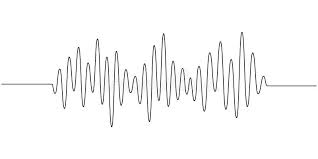

```{r, setup, include=FALSE}
knitr::opts_chunk$set(
  comment = '', fig.width = 6, fig.height = 4, warning = FALSE, message = FALSE
)
```


class: title-slide-section, middle
<br>
<br>
<br>
<br>
# Una breve introducción a la fonética y la fonología 

---
class: title-slide-section, middle
<br>
## La **fónetica** es el estudio de los sonidos 

---


background-image: url(./images/praat_ex.png)
background-size: contain

---
class: title-slide-section, middle

<br>
## La **fonologia** es el estudio de los sistemas de sonidos 

---

background-image: url(./images/phon_sp.png)
background-size: contain

---

class: title-slide-section, middle
<br>
<br>
<br>
## ¿Porque estudiamos los dos?


---

class: title-slide-section, middle


<br>
<br>
## **El habla es inherentemente variable**.

### El mismo sonido nunca se produce de exactamente la misma manera 

--

.large[
A pesar de esto, nos entendemos. ¿Por qué? 

¿Qué es un **sonido**? Definimos en grupos.
]

---

# Possibles respuestas

--

### Aunque el habla es variable, nos entendemos. ¿Por qué? 

--

> Nos entendemos porque el hablante **entiende una categoria abstracta** dentro del habla variable. Por ejemplo, aunque el sonido /p/ puede tener una duración en ingles entre 50 y 150 millisegundos, entendemos /p/.


---

# Defininos el concepto de sonido 
--
.pull.left[
### Un sonido puede ser un valor acustico que se puede medir.

- La duración.

- La frecuencia (f0)

- La calidad (los formantes)

]

.pull.right[
```{r, echo = FALSE}
knitr::include_graphics(here::here("texas_tech", "ug_teaching", "images", "ac.png"))
```
]


---

background-image: url(./images/praatlogo.png)
background-size: contain

.footnote[PRAAT https://www.fon.hum.uva.nl/praat/]


---

# Las Vocales 

.large[
[Describimos las vocales según la posición de la lengua en la boca](https://docs.google.com/presentation/d/1RNlL3PFT7Y22ZNos19JJLxYZYyiDQpygFcRQbWAtA44/edit#slide=id.g29822fe7ee9_0_149)
]

--

.large[
La posición relativa de la lengua en la boca tiene un correlato acústico: **los formantes**.
]

--

.large[
Un formante es el pico de intensidad en el espectro de un sonido que se mide en hercios (Hz) 
]


.footnote[https://kparrish92.shinyapps.io/formant_app/]

---

background-image: url(./images/formantes_2.png)
background-size: contain


---

# Defininos el concepto de sonido 
--
.pull.left[
### Un sonido puede ser un valor abstracto - el sonido "b" 
]

--

.large[
¿Por qué son diferentes, por ejemplo, /p/ y /b/?
]

--

.large[
Son diferentes, porque se usa para distinguir palabaras (pala vs. bala)

Por eso, se llaman **fonemas** (ej. Los sonidos [p] y [b] son fonémicos en español)
]

---

class: title-slide-section, middle
<br>
## ¿Son diferentes, los sonidos .red[[p]] y .blue[[b]] en inglés y español?

---

# Las diferencias fonéticas y fonémicas.

--

.large[
Los sonidos .red[[p]] y .blue[[b]] existen en inglés y español y se usa para disinguir palabras - así que **no hay una diferencia fonémica**.
]

--

.large[
Pero sí **hay diferencias fonéticas** importantes entres estos sonidos en las lenguas romances y las lenguas germánicas. 
]
 
---

# Las diferencias fonéticas y fonémicas.

.large[
.pull-left[
La **.green[/p/] del inglés** se aspira y tiene una duración larga.

La **.green[/b/] del inglés** no se aspira y tiene una duracion más breve de la /p/.
]]

--

.large[
.pull-right[
La **.blue[/p/] del español** no se aspira y tiene una duración parecida al la /b/ del inglés.

La **.blue[/b/] del español** muestra lo que se llama "prevoicing" (un valor negativo).
]]

---
class: title-slide-section, middle
<br>
<br>
<br>
<br>
# Hay preguntas?


---

# La fonética es dificil de aprender. 

.pull-left[
.full-width[
.content-box-grey[
No se encuentra muchas personas que hablen "perfectamente" en su L2. 

Hay muchos estudios que muestran que **la producción de los L2-learners** todavía se juzga como **acentuados** por los hablantes nativos, aun después de años (Oyama 1976; Flege et al. 1995a; Flege et al. 1999).

También **no perciben las diferencias/contrastes** entre ciertos sonidos  (Caramazza et al. 1973; Bohn and Flege 1992; Flege et al. 1992, 1995b, 1999b; Munro et al. 1995; MacKay et al. 2001; Piske et al. 2002).
]]]
--

.pull-right[
.full-width[
.content-box-grey[
Hay muchas ideas que se propone para explicar por qué:

- Varios factores relacionados con la edad. 

- La duración de la residencia en país nuevo.

- La motivación. 

- El aptitud para el aprendizaje de idiomas.

]]]

---


class: title-slide-section, middle
<br>
<br>
<br>
<br>
# ¿Cómo enseñamos fonética L2?

---

# El efecto McGurk

La percepción del habla involucra tanto pistas acústicas como visuales.

Observemos esto a través del **efecto McGurk**.

**Mira este video:** [El efecto McGurk](https://www.youtube.com/watch?v=2k8fHR9jKVM)

---

# High Variability Phonetic Training

.pull-left[
.full-width[
.content-box-grey[
**High Variability Phonetic Training** (HVPT) es un método de enseñar la percepción de nuevos contrastes de la L2.

Normalmente, los alumnos de L2 están expuestos sobre todo a la voz de su profesor como ejemplo de pronunciación.

HVPT utiliza .blue[varias voces], en vez de solo una, en entranemineto.

Hay evidencia que la producción mejora junto con la percepción.
]]]

---

# Introducción 

.pull-left[
.full-width[
.content-box-grey[
El uso de varias voces **introduce variabilidad**.
]]]





---

# La percepción del habla

.pull-left[
.full-width[
.content-box-grey[
En la percepción del habla:

el hablante produce **un señal acústico variable**, codificado con información fonémica.

el oyente tiene que percibir este señal y **mapea esta información** en su representación mental. 
]]]

--

.pull-right[
.full-width[
.content-box-grey[
Se hace esto usando **pistas acústicas**, o dimensiones comunes presentes en el señal acúsitco   

- Percibimos frequencias en herzios de las vocales que se llaman **formantes** que nos ayuda a identificarlas.

- Somos sensibles a **la duración** (la diferencia entre /p/ y /b/ se debe a la duración)
]]]

---

# La percepción del habla


.pull-left[
.full-width[
.content-box-grey[
Los sonidos que producimos son **variables**, pero entendemos **categorías**.

Eso implica **entendemos algo importante en común** que nos permite identificar los sonidos del habla con éxito. 
]]]

--

.pull-right[
.full-width[
.content-box-grey[
Hablantes diferentes de la misma lengua **producen los sonidos usando las mismas pistas acústicas**

A la vez producen otros aspectos del mismo sonido de **formas muy individuales**. 

El aprendiz no sabe al principio cuáles son las pistas importantes, y no tiene suficiente información con menos voces.

Con el HVPT, el uso de varias voces permite que los aprendices aprendan implícitamente **qué pistas acústicas son fiables entre varios hablantes** para distinguir sonidos y cuáles no lo son. 
]]]
---

# La Historia de HVPT: el experimento principal 

.pull-left[
.full-width[
.content-box-grey[
.green[Logan, Lively, y Pisoni (1991)]

Grabaron .red[68] pares mínimos de /r/ y /l/ (rock-lock) en inglés producidos por 6 hablantes. 

Los oyentes L1 japoneses realizaron un pretest, fueron entrenados y un posttest (idéntico al pretest). 

Había un grupo con entranamiento con 6 voces y otro con una voz.

En cada fase, realizaron una .red[tarea de identificación de elección forzada] (¿es esta palabra rock o lock)?
]]]

--

.pull-right[
.full-width[
.content-box-grey[
.red[Resultados]

Completaron .red[15 sesiones de entrenamiento] a lo largo de tres semanas. 

Sólo mejoraron los que habían entrenado.

Las mejoras también se generalizan a palabras nuevas.

El aprendizaje parece durar **a largo plazo** (Lively, Pisoni, Yamada, Tohkura, Yamada, 1994).

También **mejoraron su pronunciación**.
]]]

---

# Retos y otros factores 

.pull-left[
.full-width[
.content-box-grey[
**El HVPT podría ser más eficaz para algunos alumnos que para otros.**
Las personas con mejor percepción inicial del tono respondieron mejor al entrenamiento de contrastes tonales (en mandarín) 

Para una menor capacidad inicial en la percepción del habla preexistente, el orden de los estímulos es importante.
]]]

--

.pull-right[
.full-width[
.content-box-grey[
**La forma en que realizamos el entranamiento importa (con psuedowords o palabras reales).**

Thomson y Derwing (2016):  40 estudiantes de inglés L2 mejoraron la producción después de HVPT con palabras falsas (psuedowords), pero no con palabras reales.
]]]

---

# Extra info: Opciones de orden de estímulo

El orden de los estímulos en el entrenamiento también puede causar diferencias.

Los formatos en bloque o mixto.

Para una **menor capacidad inicial** en la percepción del habla preexistente, el formato de **bloque era mejor** que el mixto.

Ejemplo: Tenemos tokens de hablantes A, B y C.

El formato en bloque: .blue[TA], .blue[TA], .blue[TA], .green[TB], .green[TB], .green[TB], .red[TC], .red[TC], .red[TC].

El formato mixto:.blue[TA], .green[TB], .red[TC], .blue[TA], .green[TB], .red[TC], .blue[TA], .green[TB], .red[TC]

* Token del hablante A = TA
* Token del hablante B = TB
* Token del hablante C = TC

---

# Otras consideraciones 

.pull-left[
.full-width[
.content-box-grey[
**Preguntas abiertas en la investigación** 

¿Cuántos hablantes son ideales?

¿Cuántos contextos fonéticos son ideales? 

¿Cuántos sonidos podemos entrenar a la vez?
]]]

---

# Repaso 

.large[
.red[La fonética] se refiere a los sonidos del habla, mientras que .green[la fonología] es su uso en la categorización y creación de palabras.
]

--

.large[
Aprender fonética en L2 es difícil: la L1 es la principal fuente de dificultad.
]

--

.large[
Para el aprendizaje puramente acústico, métodos de entrenamiento como el HVPT han demostrado su eficacia.
]

--

.large[
Aún queda trabajo por hacer para mejorar y poner en práctica la formación y su aplicación a los distintos tipos de alumnos.
]

---

class: title-slide-section, middle
<br>
<br>
<br>
<br>
# ¡Gracias!

